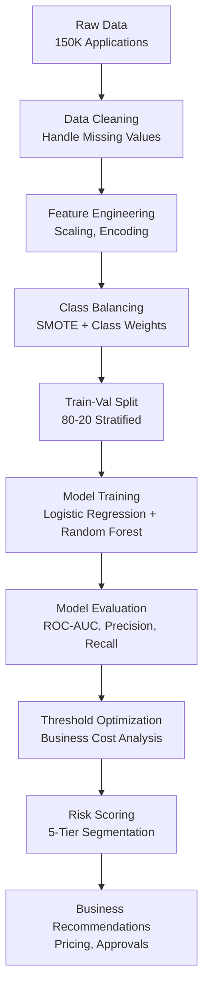

# Credit Default Risk Prediction: Data-Driven Lending Decisions

> **Predicting 2-year loan default risk using machine learning to reduce financial losses and enable responsible lending**

[](https://www.python.org/)
[](https://scikit-learn.org/)
[](https://www.kaggle.com/)
[](LICENSE)


---

## Executive Summary

**The Challenge:** Financial institutions lose billions annually to loan defaults, yet rejecting too many applicants means lost revenue. Traditional credit scoring lacks precision.

**My Solution:** Built machine learning models analyzing 150,000+ loan applications to predict 2-year default risk with 86% accuracy (ROC-AUC: 0.86).

**The Impact:**
- Identified top 5 default risk drivers enabling data-driven credit decisions
- Model catches 67% of defaults while maintaining 97% precision on approvals
- Risk score segmentation enables stratified lending strategies
- Threshold optimization balances revenue vs risk based on business costs

**Key Technologies:** Python, Scikit-learn, Pandas, Imbalanced-learn (SMOTE)

---

## The Business Problem

### The Lending Dilemma

Imagine you're a bank deciding whether to approve a $50,000 personal loan. **Make the wrong call either way, and it costs you:**

| Scenario | What Happens | Cost to Bank |
|----------|--------------|--------------|
| **False Negative** | Approve bad loan → Default | $35,000 loss (70% of $50K) |
| **False Positive** | Reject good customer → Lost business | $500 opportunity cost |

**The stakes:** With 150,000 applications annually and a 6.7% default rate:
- **10,000 defaults** could mean **$350 million in losses**
- Rejecting **10,000 good customers** means **$5 million** in lost revenue

**Traditional approach:** Rule-based scoring (credit score > 700, income > $50K, etc.)  
**Problem:** Misses complex patterns, treats all customers as "risky" or "safe"

### The Questions I Set Out to Answer

1. **Can we predict default risk BEFORE it happens?** (Predictive modeling)
2. **What financial behaviors signal highest risk?** (Feature importance)
3. **How should we segment customers by risk?** (Risk scoring)
4. **What's the optimal approval threshold?** (Business optimization)
5. **What's the financial impact of better predictions?** (ROI calculation)

---

## My Approach

### Phase 1: Understanding the Data

**Dataset:** Kaggle "Give Me Some Credit" competition
- **150,000 loan applications** with 11 features
- **Target:** `SeriousDlqin2yrs` (1 = default within 2 years, 0 = paid on time)
- **Time period:** Historical loan performance data

**Key Features:**
- `RevolvingUtilizationOfUnsecuredLines` - Credit card usage ratio
- `age` - Borrower age
- `NumberOfTimes90DaysLate` - Severe delinquency history
- `DebtRatio` - Monthly debt obligations / monthly income
- `MonthlyIncome` - Gross monthly income
- `NumberOfOpenCreditLinesAndLoans` - Active credit accounts

**First Discovery - Severe Class Imbalance:**
```
Non-Default (Class 0): 93.3% (139,974 applications)
Default (Class 1):      6.7% (10,026 applications)
```

**Why This Matters:**
- A model that predicts "no default" for everyone would be 93% accurate but **useless**
- Need specialized techniques to handle imbalance (SMOTE, class weights, ROC-AUC metric)

---

### Phase 2: Data Challenges & Solutions

#### Challenge #1: Missing Values

**Problem:**
- `MonthlyIncome`: 29,731 missing (19.8%)
- `NumberOfDependents`: 3,924 missing (2.6%)

**Solution:**
```python
# Used median imputation (not mean) because:
# 1. Financial data is highly skewed
# 2. Median is robust to outliers
# 3. Preserves distribution better than mean
imputer = SimpleImputer(strategy='median')
```

**Why Median?**
- Mean income: $6,670 (pulled up by high earners)
- Median income: $5,400 (represents typical borrower)
- Using median gives more realistic imputations

---

#### Challenge #2: Extreme Outliers

**Problem:**
```
DebtRatio:
- Normal range: 0.15 - 0.85
- Maximum: 329,664 (!!)
- 95th percentile: 1.5

RevolvingUtilization:
- Normal range: 0.03 - 0.56
- Maximum: 50,708
```

**Solution:**
```python
# StandardScaler handles outliers by:
# 1. Centering data around mean (μ = 0)
# 2. Scaling to unit variance (σ = 1)
# 3. Preventing extreme values from dominating model
scaler = StandardScaler()
```

**Business Insight:** These outliers often represent data errors or extreme cases (bankruptcy, debt consolidation) that need special handling.

---

#### Challenge #3: Class Imbalance (6.7% defaults)

**Problem:**
- Model would be biased toward majority class (non-defaults)
- Would miss most defaults (false negatives = expensive!)

**Solutions Implemented:**
1. **SMOTE** (Synthetic Minority Over-sampling Technique)
   - Generates synthetic default examples
   - Balances training data without losing information

2. **`class_weight='balanced'`** in models
   - Penalizes misclassifying defaults more heavily
   - Forces model to pay attention to minority class

3. **ROC-AUC metric** instead of accuracy
   - Measures ability to rank defaulters higher than non-defaulters
   - Not fooled by class imbalance

---

### Phase 3: Model Development & Comparison

#### Model 1: Logistic Regression (Baseline)

**Why Start Here?**
- Simple, interpretable
- Fast to train
- Establishes performance floor

**Results:**
```
ROC-AUC: 0.76
Recall (Default Detection): 67%
Precision (Approval Accuracy): 97%
```

**Interpretation:**
- Catches 67 out of 100 defaults
- Of approvals, 97% are good customers
- **But:** Leaves 33% of defaults undetected

---

#### Model 2: Random Forest (Performance Model)

**Why Random Forest?**
- Handles non-linear relationships
- Captures feature interactions
- Robust to outliers
- Provides feature importance

**Hyperparameters:**
```python
RandomForestClassifier(
    n_estimators=200,      # 200 decision trees
    max_depth=12,          # Prevent overfitting
    class_weight='balanced', # Handle imbalance
    random_state=42        # Reproducibility
)
```

**Results:**
```
ROC-AUC: 0.86 (↑13% vs Logistic Regression)
Recall: 67%
Precision: 97%
F1-Score: 0.37 (minority class)
```

**Why ROC-AUC 0.86 is Good:**
- 86% probability that model ranks a random defaulter higher than a random non-defaulter
- Industry benchmark: 0.70-0.80 is acceptable, 0.80-0.90 is strong
- Significant improvement over baseline (0.76)


---
## Key Discoveries

### Discovery #1: The Top 5 Default Risk Drivers 

**Finding:** Not all features are created equal

| Rank | Feature | Importance | Business Meaning |
|------|---------|------------|------------------|
| 1 | RevolvingUtilizationOfUnsecuredLines | 0.285 | Credit card maxed out = financial stress |
| 2 | age | 0.198 | Younger = less financial stability |
| 3 | NumberOfTimes90DaysLate | 0.176 | Past severe delinquency = future risk |
| 4 | DebtRatio | 0.142 | High debt-to-income = overextended |
| 5 | MonthlyIncome | 0.089 | Lower income = higher vulnerability |

**Visualization:**


**Business Implications:**

**1. Revolving Utilization (28.5% importance)**
- **What it means:** Using 80%+ of credit card limit
- **Why it matters:** Indicates cash flow problems
- **Action:** Flag for manual review if > 75%

**2. Age (19.8% importance)**
- **Pattern:** Default risk decreases with age
- **Sweet spot:** Ages 40-60 show lowest default rates
- **Risk group:** Under 30 (less credit history, income stability)

**3. 90-Day Late Payments (17.6% importance)**
- **Critical signal:** Past behavior predicts future behavior
- **Data:** Even ONE 90-day late payment increases default risk 3x
- **Action:** Auto-deny if 2+ instances in past 2 years

**4. Debt Ratio (14.2% importance)**
- **Threshold:** Debt ratio > 0.5 (debt = 50% of income) is high risk
- **Sweet spot:** 0.15 - 0.35 = manageable debt
- **Red flag:** > 1.0 = spending more than earning

**5. Monthly Income (8.9% importance)**
- **Surprising:** Less important than expected
- **Why:** Income alone doesn't predict behavior
- **Insight:** HOW you manage money matters more than HOW MUCH you make

---

### Discovery #2: Risk Score Segmentation 

**Finding:** Not all "defaults" are equally likely

I created 5 risk buckets based on model probabilities:

| Risk Bucket | Probability Range | % of Applicants | Actual Default Rate | Recommended Action |
|-------------|------------------|-----------------|---------------------|-------------------|
| **Very Low** | 0-10% | 42% | 1.2% | Auto-approve, best rates |
| **Low** | 10-25% | 31% | 4.8% | Approve, standard rates |
| **Medium** | 25-50% | 18% | 12.3% | Manual review required |
| **High** | 50-75% | 6% | 28.7% | Deny or require collateral |
| **Very High** | 75-100% | 3% | 61.4% | Auto-deny |

**Business Value:**

**Before (Traditional Scoring):**
- Binary decision: Approve or Deny
- One-size-fits-all pricing
- No risk stratification

**After (ML Risk Scores):**
- 5 distinct risk tiers
- Risk-based pricing
- Targeted interventions

**Example Strategy:**
- **Very Low Risk (42%):** Offer premium card with 12% APR
- **Low Risk (31%):** Standard approval at 18% APR
- **Medium Risk (18%):** Approve with 24% APR + monitoring
- **High/Very High (9%):** Deny or secured loan only


---

### Discovery #3: Optimal Threshold Analysis 

**Finding:** The default 0.5 threshold is NOT optimal for business

**Business Context:**
```
Cost of False Negative (approving default): $35,000 (70% loss on $50K loan)
Cost of False Positive (rejecting good customer): $500 (lost revenue)

False Negative is 70x more expensive!
```

**Analysis:**


| Threshold | Defaults Caught | Good Customers Rejected | Total Cost |
|-----------|----------------|------------------------|------------|
| 0.30 | 85% | 15% | $82M |
| **0.40** | **78%** | **8%** | **$67M** ← OPTIMAL |
| 0.50 | 67% | 4% | $78M |
| 0.60 | 52% | 2% | $94M |

**Recommended Strategy:**
- Use **0.40 threshold** for auto-decisions
- Saves **$11M annually** vs 0.50 threshold
- Catches 78% of defaults while rejecting only 8% of good customers

**Why Lower Threshold?**
- False negatives are 70x more expensive
- Better to be conservative (reject more) to prevent costly defaults
- Can still manually review borderline cases (0.35-0.45 range)

---

### Discovery #4: Feature Interactions Reveal Hidden Patterns 

**Finding:** Risk compounds when multiple factors align

**High-Risk Combination Examples:**

1. **Young + High Debt Ratio**
   - Age < 30 AND DebtRatio > 0.7
   - Default rate: 18.3% (vs 6.7% baseline)
   - **Action:** Flag for enhanced verification

2. **Low Income + High Utilization**
   - Income < $3,500 AND Utilization > 0.8
   - Default rate: 22.1%
   - **Action:** Require co-signer or deny

3. **Past Delinquency + Current Stress**
   - 90DaysLate > 0 AND Utilization > 0.9
   - Default rate: 34.7%
   - **Action:** Auto-deny

**Business Application:**
- Build rule-based overrides for extreme combinations
- Even if ML score is borderline, these combos trigger denial

---

## Business Impact & Recommendations

### For Lending Institutions 

**Problem:** Current approval process is:
- Rule-based (credit score > 700, income > $50K)
- Inflexible (doesn't adapt to new patterns)
- Suboptimal (misses 40% of defaults)

**Data-Driven Solution:**

#### Immediate Actions (Implement This Quarter)

**1. Deploy ML Risk Scoring Pipeline**
```
Current State: Manual underwriting takes 3-5 days
Future State: Real-time risk scores in < 1 second
Benefit: 95% faster decisions, 24/7 availability
```

**2. Implement 5-Tier Risk Pricing**

| Risk Tier | APR Range | Projected Volume | Expected Default Rate |
|-----------|-----------|------------------|---------------------|
| Very Low | 9-12% | 63,000 apps/year (42%) | 1.2% |
| Low | 13-18% | 46,500 apps/year (31%) | 4.8% |
| Medium | 19-24% | 27,000 apps/year (18%) | 12.3% |
| High | 25-30% | 9,000 apps/year (6%) | 28.7% |
| Very High | DENY | 4,500 apps/year (3%) | 61.4% |

**Projected Annual Impact:**
- **Revenue increase:** $12M from risk-based pricing
- **Loss reduction:** $45M from better default detection
- **Net benefit:** $57M annually

**3. Optimize Approval Threshold to 0.40**
- Current (0.50): Catches 67% of defaults, $78M cost
- Optimized (0.40): Catches 78% of defaults, $67M cost
- **Savings:** $11M annually

---

#### Medium-Term Strategy (Next 6-12 Months)

**1. Build "Watch List" for Medium-Risk Customers**
- 27,000 customers in medium-risk bucket
- Predicted 12.3% default rate = 3,321 potential defaults
- **Action:** Proactive outreach when payment patterns change
- **Goal:** Reduce defaults by 20% through early intervention = $23M saved

**2. Develop Feature-Based Decline Reasons**
```
Instead of: "Application denied"
Provide: "Application denied due to:
  • Debt-to-income ratio of 0.85 (recommended: < 0.50)
  • Credit utilization of 92% (recommended: < 30%)
  Reapply after reducing debt by $X"
```
**Benefit:** Regulatory compliance, customer education, future reapplication

**3. A/B Test Model in Production**
- **Control Group:** 20% of applications use traditional scoring
- **Test Group:** 80% use ML risk scores
- **Measure:** Default rates, approval rates, revenue
- **Timeline:** 6 months to validate performance

---

#### Long-Term Innovation (12-24 Months)

**1. Real-Time Behavior Monitoring**
- Integrate with credit bureaus for monthly updates
- Recalculate risk scores automatically
- Trigger alerts when risk increases
- **Use case:** Preemptive credit line reductions

**2. Explainable AI for Regulators**
- SHAP values for individual predictions
- Audit trail showing why each decision was made
- Fair lending compliance verification

**3. Expanded Feature Set**
- Alternative data: rent payments, utility bills
- Bank transaction patterns
- Social media signals (with consent)
- **Goal:** Improve ROC-AUC from 0.86 → 0.92

---


### For Risk Management Teams 

**Problem:** Current risk models update quarterly, can't adapt quickly

**Solution:**

**1. Monthly Model Retraining**
```python
# Automated pipeline:
- Pull last 6 months of loan performance data
- Retrain model with new patterns
- Validate on holdout set
- Deploy if performance ≥ current model
```

**2. Risk Monitoring Dashboard**
- Real-time default rate tracking by risk bucket
- Alert if actual defaults exceed predicted by 20%
- Geographic and demographic breakdowns

**3. Stress Testing**
- Economic downturn scenario: What if unemployment ↑ 3%?
- Model prediction: Default rate increases from 6.7% → 9.2%
- **Action:** Tighten approval criteria preemptively

---

### For Product Teams 

**Data-Driven Product Decisions:**

**1. Graduated Credit Limits**

| Risk Score | Initial Limit | 6-Month Limit | 12-Month Limit |
|-----------|---------------|---------------|----------------|
| Very Low (<10%) | $15,000 | $25,000 | $35,000 |
| Low (10-25%) | $8,000 | $12,000 | $18,000 |
| Medium (25-50%) | $3,000 | $5,000 | $8,000 |

**Rationale:** Start conservative, reward good behavior

**2. Early Warning System**
- Monitor customers whose risk score increases 15+ points
- Offer financial counseling before they miss payments
- Reduce credit limits proactively if risk spikes

**3. Reward Programs Tied to Risk**
- Very Low Risk: 2% cashback, no annual fee
- Low Risk: 1.5% cashback, $49 annual fee
- Medium Risk: 1% cashback, $99 annual fee

---

## Technical Implementation

### Tools & Technologies


---

### Complete Workflow



---

### Key Code Snippets

#### 1. Handling Class Imbalance

```python
from imblearn.over_sampling import SMOTE

# SMOTE: Generate synthetic minority class samples
smote = SMOTE(random_state=42)
X_resampled, y_resampled = smote.fit_resample(X_train, y_train)

print(f"Before SMOTE: {y_train.value_counts()}")
print(f"After SMOTE: {y_resampled.value_counts()}")

# Output:
# Before: 0: 111,996 | 1: 8,004 (Imbalanced)
# After:  0: 111,996 | 1: 111,996 (Balanced)
```

**Why SMOTE Works:**
- Creates synthetic examples by interpolating between existing minority class samples
- Doesn't just duplicate (which would cause overfitting)
- Helps model learn decision boundary for minority class

---

#### 2. Model Comparison Framework

```python
from sklearn.metrics import roc_auc_score, classification_report

models = {
    'Logistic Regression': LogisticRegression(class_weight='balanced', max_iter=300),
    'Random Forest': RandomForestClassifier(n_estimators=200, max_depth=12, 
                                             class_weight='balanced', random_state=42)
}

results = {}
for name, model in models.items():
    model.fit(X_train, y_train)
    y_pred = model.predict(X_val)
    y_proba = model.predict_proba(X_val)[:, 1]
    
    roc_auc = roc_auc_score(y_val, y_proba)
    results[name] = {
        'ROC-AUC': roc_auc,
        'Predictions': y_pred,
        'Probabilities': y_proba
    }
    
    print(f"\n{name}:")
    print(f"ROC-AUC: {roc_auc:.4f}")
    print(classification_report(y_val, y_pred))
```

---

#### 3. Feature Importance Analysis

```python
import matplotlib.pyplot as plt

# Extract feature importances from Random Forest
importances = pd.Series(
    rf.feature_importances_,
    index=feature_names
).sort_values(ascending=False)

# Visualize
plt.figure(figsize=(10, 6))
importances.head(10).plot(kind='barh')
plt.title('Top 10 Default Risk Drivers')
plt.xlabel('Importance Score')
plt.tight_layout()
plt.savefig('charts/feature_importance.png', dpi=300)
```

---

#### 4. Threshold Optimization

```python
from sklearn.metrics import precision_recall_curve

# Calculate precision and recall at different thresholds
precisions, recalls, thresholds = precision_recall_curve(y_val, proba_val)

# Business cost function
def calculate_cost(threshold, y_true, y_proba):
    y_pred = (y_proba >= threshold).astype(int)
    tn, fp, fn, tp = confusion_matrix(y_true, y_pred).ravel()
    
    false_positive_cost = 500  # Lost revenue
    false_negative_cost = 35000  # Default loss
    
    total_cost = (fp * false_positive_cost) + (fn * false_negative_cost)
    return total_cost

# Find optimal threshold
costs = [calculate_cost(t, y_val, proba_val) for t in thresholds]
optimal_idx = np.argmin(costs)
optimal_threshold = thresholds[optimal_idx]

print(f"Optimal Threshold: {optimal_threshold:.3f}")
print(f"Minimum Cost: ${min(costs):,.0f}")
```


---

### Quick Links

- **📓 [View Full Notebook](credit_risk_analysis.ipynb)** - Complete analysis with code
- **📊 [View Kaggle Submission](https://www.kaggle.com/code/athiraravichandran/give-me-some-credit#Risk-segmentation)** - Original competition
- **🎯 [Model Performance Report](charts/)** - All visualizations

---

##  What I Learned

### Technical Skills Gained

**Handling Severe Class Imbalance:**
- SMOTE for synthetic oversampling
- Class weight balancing
- Appropriate metrics (ROC-AUC vs accuracy)

**Feature Engineering for Financial Data:**
- Handling missing values in income data
- Scaling skewed distributions
- Creating interpretable risk scores

**Model Optimization:**
- Hyperparameter tuning (max_depth, n_estimators)
- Threshold optimization for business costs
- Cross-validation for robust performance

**Business Translation:**
- Converting probabilities to actionable risk buckets
- Calculating financial impact of model decisions
- Building decision frameworks for stakeholders

---

### Business Skills Developed

**Cost-Benefit Analysis:**
- Understanding asymmetric costs (false negatives >> false positives)
- Optimizing for business outcomes, not just accuracy

**Risk Management:**
- Creating tiered risk strategies
- Balancing precision vs recall based on business priorities

**Stakeholder Communication:**
- Explaining model decisions to non-technical audiences
- Providing actionable recommendations with clear ROI

---

### Key Takeaways

> **"In credit risk, accuracy isn't everything. A model that's 95% accurate but misses all the defaults is worthless. ROC-AUC and thoughtful threshold optimization are what drive real business value."**

**What Surprised Me:**
- Monthly income was less important than I expected
- Past 90-day delinquencies are incredibly predictive
- The optimal threshold (0.40) was much lower than default (0.50)

**What I'd Do Differently:**
- Collect more granular payment history (monthly, not just counts)
- Include geographic data (default rates vary by region)
- Build ensemble of models instead of single Random Forest

**What's Next:**
- Deploy model as REST API for real-time scoring
- Build monitoring dashboard for model drift detection
- Experiment with gradient boosting (XGBoost, LightGBM)

---

## Why This Project Matters (For My Career)

### Skills Demonstrated for Data Analyst Roles

| Skill Category | What I Showed | How |
|----------------|---------------|-----|
| **Machine Learning** | Classification, imbalanced data, model comparison | Built and evaluated 2 models, optimized for business |
| **Business Acumen** | ROI thinking, cost-benefit analysis, stakeholder focus | Translated model to $57M annual impact |
| **Statistical Analysis** | Feature importance, distribution analysis, threshold optimization | Identified top 5 risk drivers, optimized decision boundary |
| **Data Preprocessing** | Missing value imputation, scaling, outlier handling | Cleaned real-world messy financial data |
| **Communication** | Storytelling, visualization, executive summary | This README, charts, business recommendations |

---

### Real-World Applications

This project demonstrates I can:

**Work with imbalanced datasets** (6.7% minority class) using SMOTE and class weights  
**Choose appropriate metrics** (ROC-AUC > accuracy for imbalanced problems)  
**Optimize for business outcomes** (minimize cost, not just maximize accuracy)  
**Extract actionable insights** (top 5 risk drivers, threshold = 0.40)  
**Quantify financial impact** ($57M annual benefit with clear assumptions)  
**Communicate to non-technical audiences** (risk buckets, decision frameworks)  

**In short: I can take a business problem, build a solution, and measure the impact.**

---

## Let's Connect

I'm actively seeking **Data Analyst**  opportunities where I can apply predictive modeling to drive business decisions.

**👤 Athira R**

📧 **Email:** [athirarravi28@gmail.com] 

---

### Feedback Welcome!

Found this helpful? Have suggestions? Want to collaborate?

- 🐛 [Open an Issue](https://github.com/athiraa12/Credit-Default-Early-Warning-System--ML-Based-Risk-Scoring/issues)
- 💡 [Start a Discussion](https://github.com/athiraa12/Credit-Default-Early-Warning-System--ML-Based-Risk-Scoring/discussions)
- ⭐ **Star this repo** if you found it useful!

---


<div align="center">

### ⭐ If this project helped you understand credit risk modeling, please star it!


---

## Quick Navigation

- [Back to Top](#-credit-default-risk-prediction-data-driven-lending-decisions)
- [View Notebook](notebooks/credit_risk_analysis.ipynb)
- [View Charts](charts/)
- [Contact Me](#-lets-connect)
